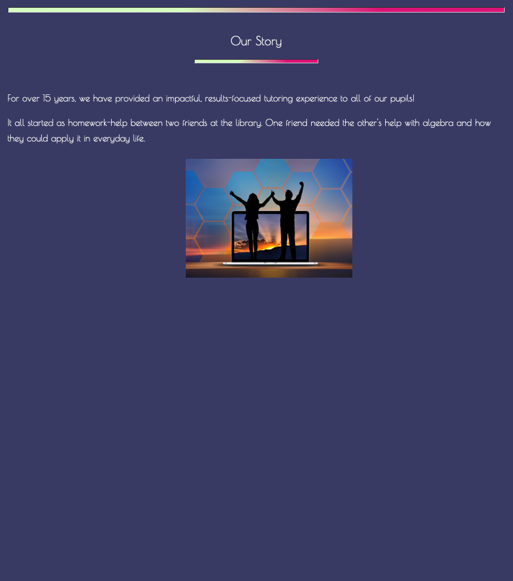
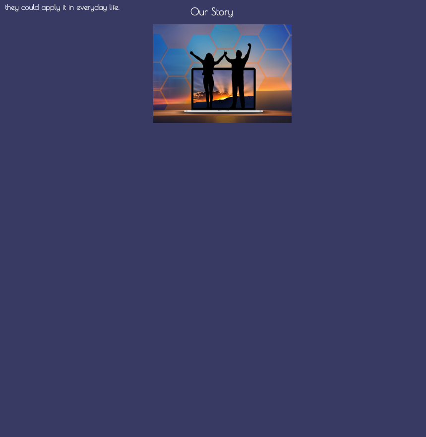
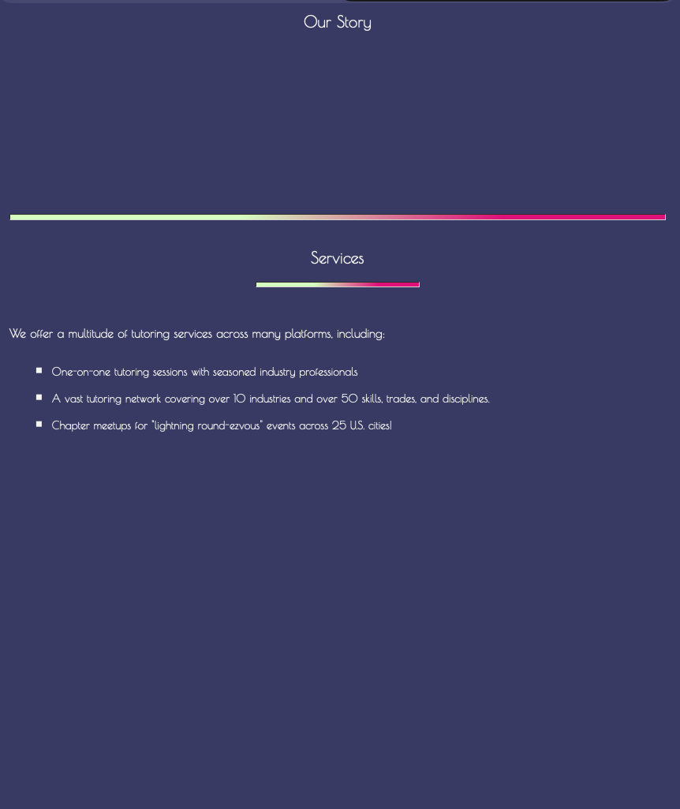
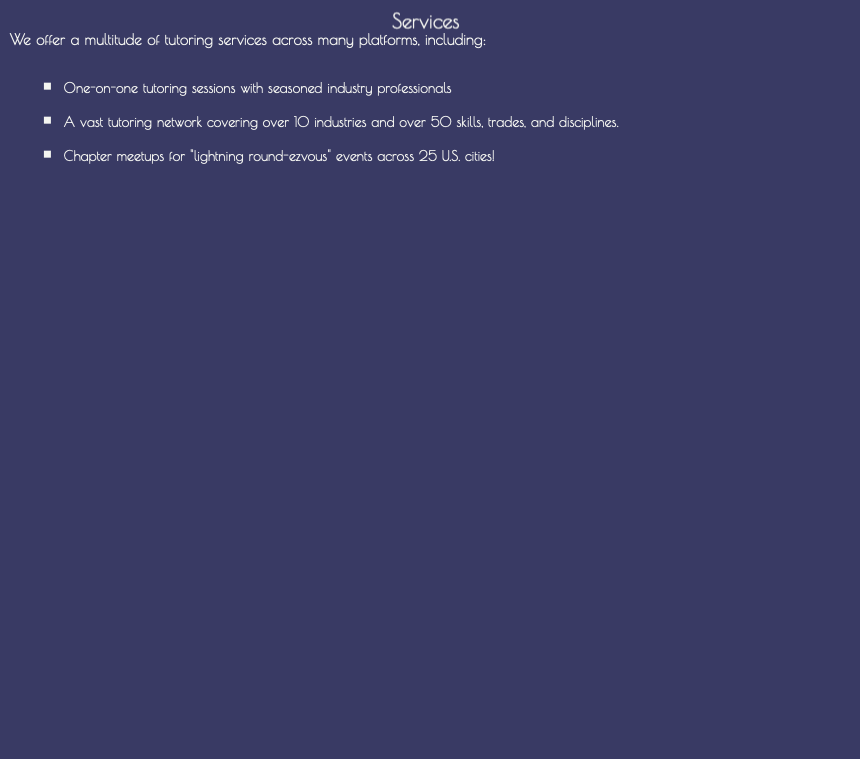

<!-- & This creates a banner for the ReadMe -->


# <p align="center">🌸 Sticky Elements 🌸</p>

## Practice: Creating a Webpage building upon HTML basics and understanding how to use CSS Basics

### Understanding CSS -> Disturbing a Page's Flow with Position: Sticky

<hr>

## <p align="center">💫 Overview</p>
-   [ ] This is a CSS tutorial that demonstrates <b>position: sticky</b> through a mock tutoring company website. The tutorial shows how sticky elements remain in the normal document flow until reaching a specified scroll position, then "stick" in place while the rest of the content continues to scroll past them.

<hr>

## <p align="center">🎨 Key Design Features</p>
-   [ ] <b>Cherry Blossom theme</b> for the color scheme across both pages
-   [ ] <b>Grdient Dividers</b> between sections
-   [ ] <b>Flexbox Layout</b> for header and footer alignment
-   [ ] <b>Consistent styling</b> across both pages through a single CSS file (style.css)

<hr>

-   [ ] Simple practice to gain a better understanding of the power of adding CSS Styling to a webpage and how it can make it uniquely beautiful
    -   [ ] CSS or Cascading Style Sheet, is a language that paints a website with colors, fonts, layouts, and animations.
    -   [ ] CSS is used to create stunning webpages.
    -   [ ] It can enhance the user experience, and can make a webpage unquie and stand out amongst the rest.
    -   [ ] It is absolutely beautiful to see a webpage come to life and become even more beautiful.

<hr>

-   [ ] CSS - Sticky Positioning:
    -   [ ] position: sticky
        -   [ ] This will keep an element in flow with the other elements of a webpage
        -   [ ] Elements stay stay in its normal spot until it is a certain distance from the top of its containing element. After which it will stick to a place.

    -   [ ] For instance, using this syntax giving the section elements 100vh (givinng more scrolling room) and select the h2 elements within each section and set their position to sticky:
        ``` css
        section {
            height: 100vh;
        }

        h2 {
            position: sticky;
            top: 0;
        }
        ```

    -   By setting the top of the h2 element with the sticky position, and becuase the page body is its nearest scrolling container, each heading gets "stuck" to the top of the screen until we've scrolled past its most direct container section element.

    -   [ ] The visual examples of sticky positioning:
        -   [ ] 
        -   [ ] 
        -   [ ] 
        -   [ ] 

<hr>

## <p align="center">👩🏾‍💻 Semantic Outline of the webpage</p>
-   [ ] The &lt;header&gt; element:
    -   [ ] Is used for the beginning of the webpage
    -   [ ] Houses the title of the webpage along with Logos
    -   [ ] The &lt;figure&gt; element:
        -   [ ] Usually holds an image, illustration, diagram, code snippets, etc...
        -   [ ] It can also hold more than one
    -   [ ] The &lt;img&gt; element:
        -   [ ] Is used for all the images on the webpage

-   [ ] The &lt;nav&gt; element:
    -   [ ] This element tends to contain ordered lists, unordered lists, or even both types of lists
    -   [ ] Each &lt;li&gt; element will house an &lt;a&gt; elements with the #id-name of the desired section or part of the webpage it will be linked within the "href" attribute
        -   [ ] For instance:
            -   [ ] &lt;a href="#desired-section"&gt;🌸 Desired Section🌸&lt;/a&gt;
            -   [ ] <a href="#desired-section">🌸 Desired Section 🌸</a>
                -   [ ] When the user would click the 🌸 Desired Section 🌸 link they would then be navigated to that section of the webpage

-   [ ] The &lt;br&gt; element:
    -   [ ] Creates a new line in your code and forces whatever comes after to start on a new lin

-   [ ] The &lt;hr&gt; element:
    -   [ ] Adds a horizontal line or dividing line across the webpage
    -   [ ] Used to separate sections or different topics on a webpage

-   [ ] The &lt;main&gt; element:
    -   [ ] Is where the main information of the webpage will go
    -   [ ] The &lt;section&gt; element:
        -   [ ] This groups together pieces of similar information
    -   [ ] The &lt;article&gt; element:
        -   [ ] This will house a singular piece of information describing what this section is about in great detail

-   [ ]  The &lt;footer&gt; element:
    -   [ ]  This element tends to finish off the webpage as it is located at the very bottom of the webpage and is the last set of items that will be seen
    -   [ ] For instance:
        -   [ ] A footnote on the webpage
        -   [ ] Links to different sections of the webpage
        -   [ ] A copyright symbol for copyright information
            -   [ ] & copy; -> is the symbol for copyright
        -   [ ] A link to external sources using the "href" attribute of the &lt;a&gt; element for the links in the list item to external sources
            -   [ ] &lt;a href="/privacy"&gt;Privacy&lt;/a&gt;
                -   [ ] Use the target attribute to open the link path in a new tab instead of the current page
                -   [ ] <a href="/privacy" target="_blank">Privacy</a>
                -   [ ] When the user clicks one of these external links, they would be redirected to a new page with the informat ion

<hr>

## <p align="center">✨ Encompaassed Technologies</p>
-   [ ] HTML:
    -   [ ] Will be the structure and skeleton of how the app will appear on the webpageWill be the structure and skeleton of how the app will appear on the webpage
-   [ ] CSS:
    -   [ ] Encompass the style of the app and give it some flair

